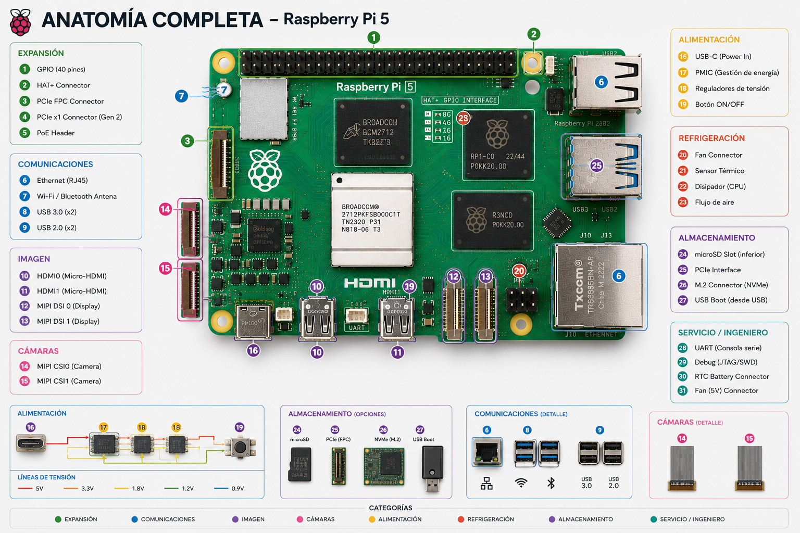

---
# Título del documento
title: "Componentes de una Raspberry Pi 5"
# "chapter" es un tipo de contenido que funciona con el tema hugo-relearn-theme. Con chapter: true, las páginas md del directorio aparecen en la barra lateral de la página html resultante
weight: 3
chapter: true
---
Decomponiendo por partes:

